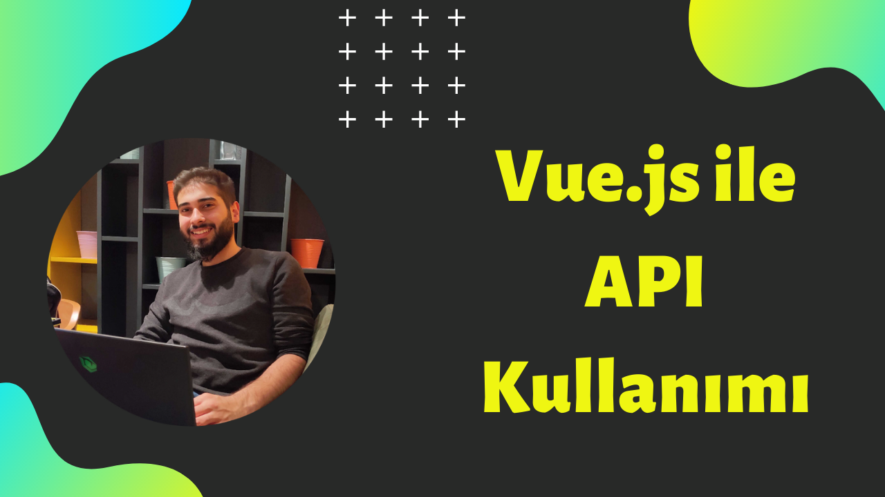

# Using API with Vue.js
- [Video Link](https://www.youtube.com/watch?v=TWY-XUVLIVk)


## Project setup
```
npm kullanıyorsanız;
npm install
npm run serve
```
```
yarn kullanıyorsanız;
yarn install
yarn serve
```

### Customize configuration
See [Configuration Reference](https://cli.vuejs.org/config/).
